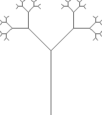
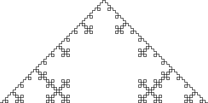
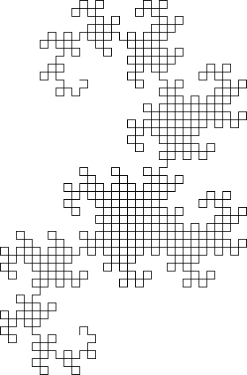
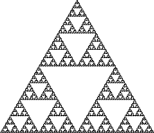
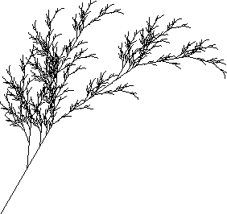
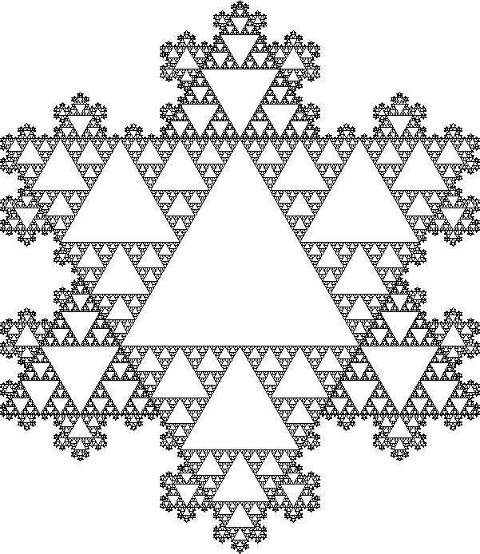

# Turtle Art

## Lindenmayer systems

A Lindenmayer system (or L-system) is a parallel rewriting system consisting of
an alphabet of symbols, a collection of rules that maps each symbol to another
symbol, an initial starting string (the "axiom"), and a method to render an
image from the result string (see [the Wikipedia
article](https://wikipedia.org/wiki/L-system) for more information).

Within this project, the `Lindenmayer` class represents a generic L-system,
but it does not provide any facility to draw the result string. If each
symbol corresponds to an atomic action (i.e., there is no additional state
involved), then the `SimpleLindenmayer` class can be used which features a
mapping from symbols to functions used to draw the result string.

### Pythagoras tree

The [pythagoras tree](https://wikipedia.org/wiki/Pythagoras_tree_(fractal)) is
an example of an L-system that requires additional state. It is constructed
as follows:

- **alphabet:** 0, 1, \[, \]
- **axiom:** 0
- **rules:** 1 → 11, 0 → 1\[0\]0

To draw the tree, the symbols are interpreted as follows:

- 0 and 1: draw a line segment
- \[: push position and angle, turn left 45°
- \]: pop position and angle, turn right 45°

Here, push and pop refer to an internal stack used to navigate the tree.

The number of iterations controls how many branches are drawn; for example,
with *n* = 5 the following tree results:

### Koch curve

A variant of the [Koch curve](https://wikipedia.org/wiki/Koch_curve) can be
constructed with the following L-system:

- **alphabet:** F, +, -
- **axiom:** F
- **rules:** F → F+F-F-F+F

The symbols are interpreted as follows:

- F: draw forward
- +: turn left 90°
- \-: turn right 90°

For *n* = 4, the following image results:

### Dragon curve

The [dragon curve](https://wikipedia.org/wiki/Dragon_curve) can also be drawn
with an L-system, as follows:

- **alphabet:** X, Y, F, +, -
- **axiom:** FX
- **rules:** X → X+YF+, Y → -FX-Y

As with the Koch curve, F draws forward and - and + turn left and right.

### Sierpinski triangle

The [Sierpinski triangle](https://wikipedia.org/wiki/Sierpinski_triangle) can
also be approximated by an L-system.

- **alphabet:** A, B, +, -
- **axiom:** A
- **rules:** A → +B-A-B+, B → -A+B+A-

Here the symbols are interpreted like the Koch curve above, but A and B are
used to mean 'draw forward'. For *n* = 8, the following triangle results:

### Fractal plant

L-systems can be used to draw realistic-looking plants. One such system is as
follows:

- **alphabet**: X, F, +, - , \[, \]
- **axiom:** X
- **rules:** X → F-\[\[X\]+X\]+F\[+FX\]-X, F → FF

Here as in the Pythagoras tree, \[ and \] are used to push and pop the current
position and angle onto an internal stack. The other symbols are:

- F: draw forward
- X: nothing (used to control the evolution of the curve)
- +: turn right 25°
- \-: turn left 25°

For *n* = 6, the following plant results:

## Kochpinski

The Kochpinski is a majestic combination of a Koch curve and a Sierpinski
triangle. For added majesty, make a Koch snowflake and fill in the middle with
another Sierpinski triangle:

